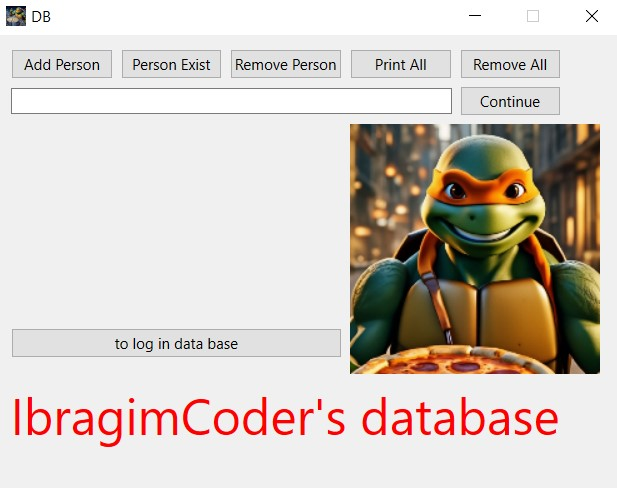
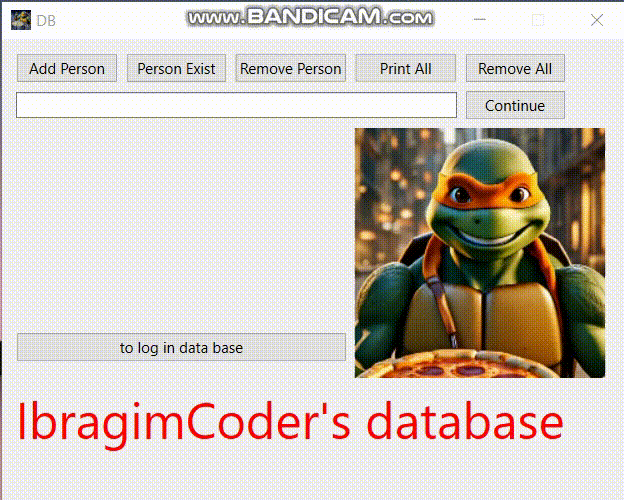

# Data Base 

This is a database with little functionality, you can add delete and also perform various actions with the data.

In order for the code to work, you need to install Qt (preferably Qt 6), as well as install the SQLITE library.

In my database you will be able to add delete check for existence clean and view the database.
The dbmanager class contains the logic and Sqlite commands. The interfaceDB class uses Qt for graphic design, as well as to use functionality and logic, the interfaceDB class was inherited by the dbmanager class.

Here is a small sample code from the project:

## `Description`

This code is an Add() method in the Interface DB class. It performs the following actions:

Clears text labels.
Checks if the lineedit input field is empty.
If the input field is not empty:
Gets the name from the input field.
Adds this name to the dataset.
Calls the AddPerson(name) function.
Clears the input field.
Sets the text label to “operation completed successfully".
Sets the text label to “log in to the database to check for changes".
Disables the input field.

``` c++
void InterfaceDB::Add()
{
    QString name;
    label_1->clear();
    label_2->clear();
    if (!lineEdit->text().isEmpty())
    {
        name = lineEdit->text();
        dataset.push_back(name);
        addPerson(name);
        lineEdit->clear();
        label_1->setText("the operation was successful");
        label_2->setText("to check the changes, log into the database");
        lineEdit->setDisabled(true);
    }

}
```


The logic of writing the rest of the functions from the child class is about the same.


## `Interface`



### How the database works?

After each operation, you need to press the CONTINUE button. Let's say you want to add a person, you should write the name of this person, and then perform the operation that you need, in our case it is adding a person to the database (Add Person) then you will receive a message about your operation, whether it worked correctly, then to continue performing some actions you should click on CONTINUE. Also, if you want, you can view the database at the current time.


Here's a video of how it works:

